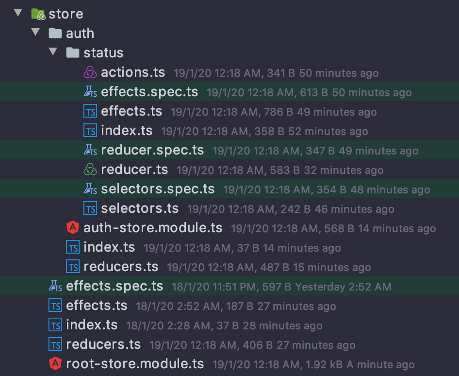
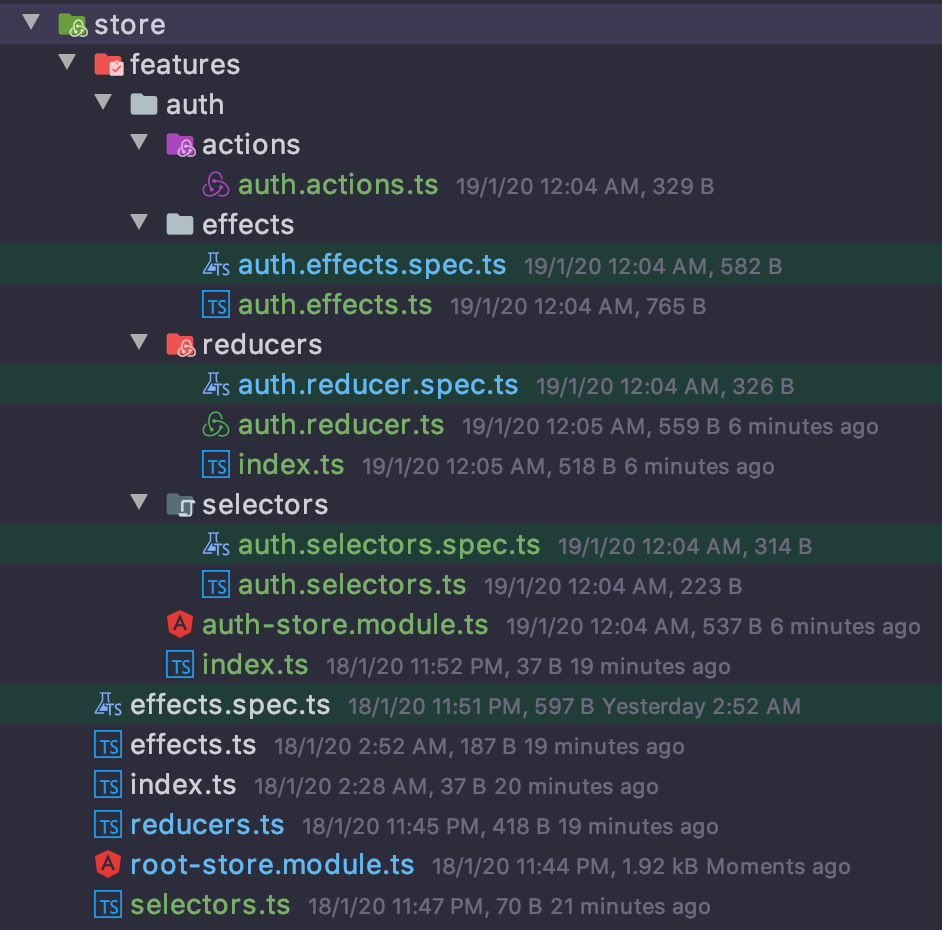

# Angular

This project was generated with [Angular CLI](https://github.com/angular/angular-cli) version 8.3.18.

## dependencies

- add `yarn add @ngrx/{store,effects,entity,store-devtools}` [NgRx](https://ngrx.io/docs) is a framework for building reactive applications in Angular. NgRx provides state management
- [Angular Prettier schematic](https://github.com/schuchard/prettier-schematic) A Schematic that adds prettier and a pre-commit hook for formatting staged files. [Docs](https://prettier.io/docs/en/options.html)

## Development server

Run `ng serve` for a dev server. Navigate to `http://localhost:4200/`. The app will automatically reload if you change any of the source files.

## Code scaffolding

Run `ng generate component component-name` to generate a new component. You can also use `ng generate directive|pipe|service|class|guard|interface|enum|module`.

## Build

Run `ng build` to build the project. The build artifacts will be stored in the `dist/` directory. Use the `--prod` flag for a production build.

## Running unit tests

Run `ng test` to execute the unit tests via [Karma](https://karma-runner.github.io).

## Running end-to-end tests

Run `ng e2e` to execute the end-to-end tests via [Protractor](http://www.protractortest.org/).

## Further help

To get more help on the Angular CLI use `ng help` or go check out the [Angular CLI README](https://github.com/angular/angular-cli/blob/master/README.md).

## Prettier Format

```typescript
// prettier-ignore
@NgModule({
  declarations: [
    DatatableHeaderComponent,
    DatatableFooterComponent,
    DatatableTableComponent,
    DatatableColumnComponent
  ],
  imports: [
    CommonModule
  ]
})
export class DatatableModule {}
```

### History generate from schematics

- `ng generate component home-container --inlineStyle --inlineTemplate --skipTests --flat` generate main component
- `ng generate component welcome-page` generate page component

## generate store

### create root steps

1. create folder name `store`
2. create module `ng generate module root-store --flat`

### create feature steps (Option 1)

1. create folder name `auth`
2. create module `ng generate module auth-store --flat`
3. create file `index.ts` in folder `auth` and export `auth-store.module`
4. create store `ng generate @ngrx/schematics:store auth --module auth-store`
5. rename file `index.ts` in folder `reducers` to `reducers.ts` and move file in `auth` folder
6. create feature `ng generate @ngrx/schematics:feature status --reducers reducers.ts --api true --flat false`

```text
? Do you want to use the create functions? Yes
? To which module (path) should the effect be registered in? auth-store
```

7. rename file

```text
status.actions.ts        -> actions.ts
status.effects.spec.ts   -> effects.spec.ts
status.effects.ts        -> effects.ts
status.reducer.spec.ts   -> reducer.spec.ts
status.reducer.ts        -> reducer.ts
status.selectors.spec.ts -> selectors.spec.ts
status.selectors.ts      -> selectors.ts
```



### create feature steps (Option 2 - group folder)

1. create folder name `auth`
2. create module `ng generate module auth-store --flat`
3. create file `index.ts` in folder `auth` and export `auth-store.module`
4. create store `ng generate @ngrx/schematics:store auth --module auth-store`
5. create feature `ng generate @ngrx/schematics:feature auth --group --reducers reducers/index.ts --api`

```text
? Do you want to use the create functions? Yes
? To which module (path) should the effect be registered in? auth-store
```



### [install] Angular Prettier schematic

```text
❯ ng add @schuchard/prettier
Installing packages for tooling via yarn.
Installed packages for tooling via yarn.
? Specify the line length that the printer will wrap on (default: 80) 120
? Specify the number of spaces per indentation-level 2
? Print semicolons at the ends of statements? Yes
? Use single quotes instead of double quotes? Yes
? Print trailing commas wherever possible when multi-line? (default: none) es5
? Add lint-staged for running Prettier against staged files? Yes
? Format all Angular Files {js,json,css,scss,less,md,ts,html,component.html} > Yes! :) Yes
CREATE .prettierignore (17 bytes)
CREATE prettier.config.js (320 bytes)
UPDATE package.json (2202 bytes)
UPDATE tslint.json (1979 bytes)
UPDATE .editorconfig (246 bytes)
✔ Packages installed successfully.
```
